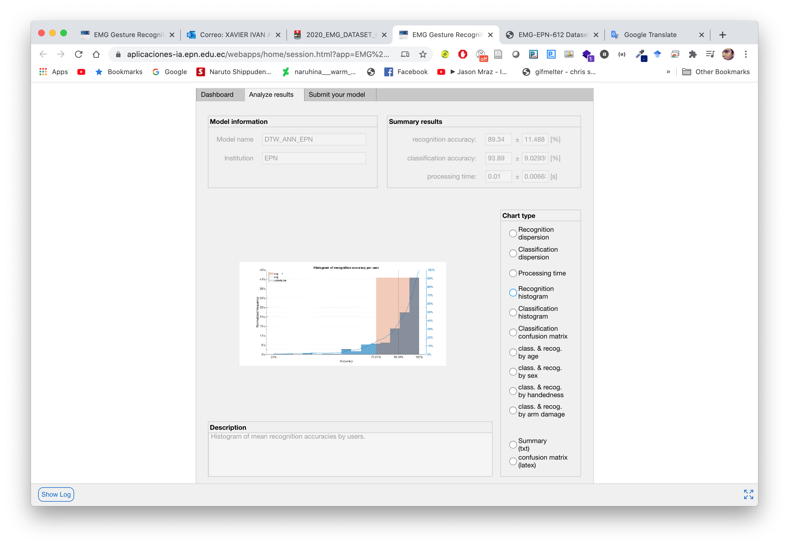

# Introduction

> This document describes briefly the steps needed to run the Matlab code to manage our proposed EMG Database. We implemented a Real-Time Hand Gesture Recognition based on Artificial Feed-Forward Neural Networks to test the data of each user.

## Description

> The “Hand Gesture Model Example MATLAB” folder contains the Matlab code to manage the EMG Database. Each script contains a description of its function as well as the copyright information. If you want to use the dataset and the code for commercial purposes, please contact to the correspondent author of the paper, Marco E. Benalcázar.

* marco.benalcazar@epn.edu.ec 
* marco_benalcazar@hotmail.com

## Description

* Matlab 2019a or newer versions
* Deep Learning toolbox
* Signal Processing toolbox

## Instructions for Matlab:

1. Go to our GitHub repository and download or clone the example to manage the dataset in Matlab [Example](https://github.com/laboratorioAI/DTW_ANN_EPN_Matlab).

    

2. Open Matlab and choose the example folder.

    

3. Compile the mex function that computes the DTW distance by running the script **compileDTWC.m** which is in the folder /DTW distance. You need to do this step only once in the computer where you will run the code. 
   
    

4. Download the dataset before running the code from the following link: 
   
   * [EMG-EPN612 Dataset](https://laboratorio-ia.epn.edu.ec/es/recursos/dataset/2020_emg_dataset_612)

    

    

5. Copy and replace the folders corresponding to the dataset in the downloaded repository folder.
   
   

6. Run the script **main.m** After running this script, you will have to wait several minutes to obtain the results. In the variable *userFolder* you can change for testing or training to choose the user group. In our case, we classified six gestures corresponding to 306 testing users.

    

7. The code starts running and analyzes all users. You can observe the progress of the code by observing the command window.

    

8. At the end of analyzing all users, the code automatically generates a .json file with the responses of each of the users.

    

9.  The “responses.json” file has the following structure:

    

10. The responses corresponding to each user are divided as shown below:

    * vectorOfLabels:  Vector with the predicted labels for the sliding windows of each sample.

    * vectorOfTimePoints:  Vector with the time corresponding to the predicted labels of vectorOfLabels.

    * vectorOfProcessingTime: Vector with the processing times corresponding to the analysis of each sliding window.

    * class:  The most frequent label (mode) in the vectorOfLabels.

    

The sample responses for the fields mentioned above (*vectorOfLabels*, *vectorOfTimePoints*, *vectorOfProcessingTimes*, *class*) are stored from **idx_0** to **idx_149**. Each user has 150 samples analyzed by the hand gesture recognition model.

  

11. In order to obtain the score of your model, it is necessary to register your data and upload your responses on our platform.  The link is as follows:
[Evaluation System](https://aplicaciones-ia.epn.edu.ec/webapps/home/session.html?app=EMG%20Gesture%20Recognition%20Evaluator).

    

12. A link is generated to upload the json file with the responses. The link to upload the files is sent to the registered email.
    
    

13. The reports contain information about classification and recognition accuracy per user, histogram of classification and recognition per user, ,time processing of model, confusion matrix, classification and recognition detailed by gender, handedness, users with arm injury and finally a .txt file with the general summary report of the model. 

    

14. The scores are shown to the public in order to maintain transparency between the results of the models given by the EMG community.

    
